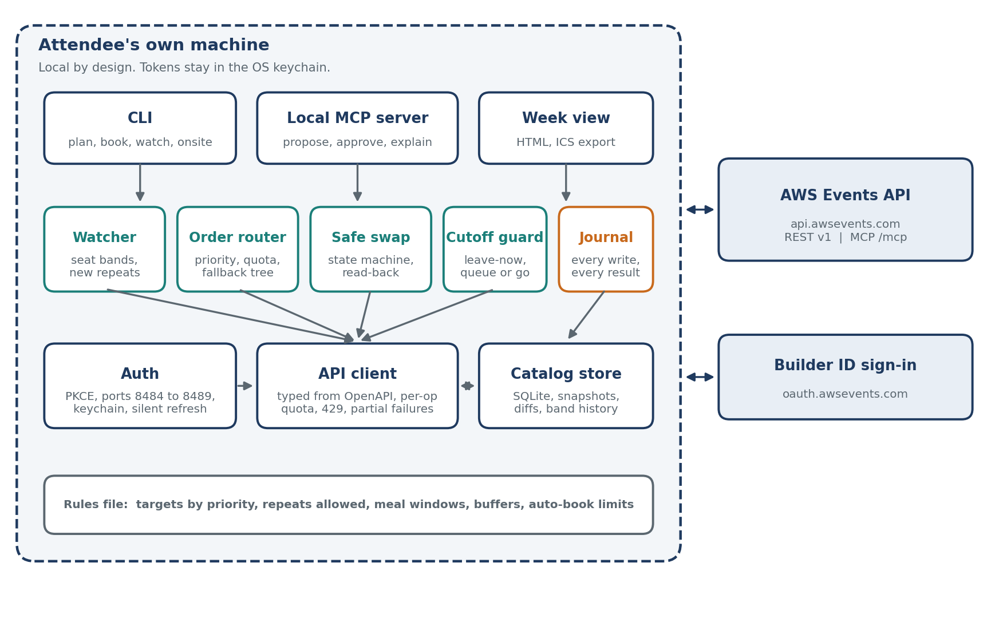

# How re:Seat works

re:Seat manages an attendee's AWS re:Invent seats after the plan is made. It watches for freed seats and newly added repeat sessions, books them within the attendee's rules, upgrades held seats without losing one, and tells the attendee when to leave and whether to queue.

It runs on the attendee's own machine against the [AWS Events API](https://docs.aws.amazon.com/events/latest/devguide/what-is-events-api.html). It keeps a journal of every write and its result. The CLI, a phone page served from the laptop, and a local MCP server all drive the same engine.

Status as of 2 October 2026 is marked on each part below: **built** means it is in this repo and tested against the fake API, **planned** means it is not written yet.

## The problem, in attendees' words

Quotes are from public Reddit threads, personal blogs and Builder Center posts, 2022 to 2026.

| Pain | First-hand account |
|---|---|
| Seats vanish on opening day | "Most things were full by 10:03am." (2022) "I didn't get anything I wanted even 3 hours after it went live." (2023) |
| Seats free up later | "Some stuff that was full yesterday I was able to reserve right now." (2024) |
| Capacity gets added | "The more popular sessions get 2-3x extra sessions once they get booked up." (2022) "They continue to add repeat sessions and adjust the schedule." (2025) |
| Refreshing in the queue | "Get in line and keep refreshing the app for the associated session. Most of the sessions will have no shows or cancellations." (2022) |
| The 10-minute rule | "Use 11 minutes as I have found myself arguing with the staff." (2025) "I was at the 50th person on the walk-up line. They only accepted 20 more walk-ups." (2023) |
| Venue distance | "Don't do one session at Venetian followed by a session at MGM. You'll never make it." (2022) |

Two things were not found in first-hand reports, so re:Seat does not claim them: a reserved session changing room or time after booking, and anyone losing both seats during a swap. The portal offers a Keep Existing or Replace choice on conflicts. The API does not. re:Seat restores that safety for API users.

## What the API gives, and what shapes the design

Full detail, with sources, is in [api-facts.md](api-facts.md).

- **Local only.** OAuth 2.0 code flow with PKCE, callback on localhost ports 8484 to 8489. No hosted redirect.
- **No search.** re:Seat pulls the whole catalog, about 2,000 sessions in 9 pages, and works locally.
- **Seat bands, not counts.** `available`, `limited`, `veryLimited`, `unavailable`, `walkUp`. A band change is the signal that a seat freed.
- **Partial success.** Reserve and favorite return 200 with a `failed` list. Unknown failure codes are treated as generic refusals.
- **No blind retry.** A repeated reserve reports `alreadyScheduled`. Cancel on a seat not held is a 404. Every write is followed by a `GetSchedule` read-back.
- **Quota counts sessions.** Ten reserves in one call spend 10 of the 30 per minute.
- **No swap.** Reserving a session that overlaps a held one is refused. Cancel must come first. That is the risk re:Seat manages.
- **Two-day gap.** The portal opens reserved seating on 6 October 2026. API writes open on 8 October. re:Seat cannot help with the first rush.
- **Time zones.** Sessions are Las Vegas local time. Personal time is UTC.

## What re:Seat does

**Favorites** (built)
- `reseat favorites sync` mirrors every target sitting, and each backup's sittings, into favorites, so the official app shows the same plan. Works before 8 October, when reservations are still closed.
- Skips sessions already favorited, sends 10 per call inside the quota, reports each failure, and reads back once at the end.

**Book** (built)
- Targets live in a rules file in priority order, with allowed repeats and backups. Each target has a fallback tree.
- Books in batches of up to 10 inside the 30 per minute budget. On `sessionFull` it moves to the target's next sitting in the same run.
- Formats that are not recorded fill first, so they are sent first: Workshop, Lab and Bootcamp, then Builders' session, Chalk talk, Code talk, Breakout session, then the rest.
- Never holds two sittings of one talk. Never books over a held session, a meal in the rules or the daily cap.
- Reads back `GetSchedule` after every write and journals request, response and read-back.

**Watch** (built)
- `reseat watch` sweeps the catalog about once a minute without abstracts and records every seat band change. The interval has a 30-second floor.
- Diffs each sweep to catch new sessions and new repeats, and books a target's new sitting the moment it appears. Planner imports list the sittings known on export day. A repeat added later still counts.
- When a freed sitting overlaps a held session of a lower-priority target, it proposes a swap with a random plan id instead of booking. Plan ids expire after 10 minutes and work once. It never proposes cancelling a seat the rules do not cover.
- A booking that fails for a reason that is not an answer about the seat, such as a server error, is tried again on the next sweep.
- A 409 means writes are switched off. The watcher keeps sweeping and keeps every opening queued, but sends no reserve and runs no swap for 15 minutes, then tries once. With a `probe_session` that can never be held, it checks every minute and resumes the moment writes open. It reports paused and resumed once each, and push carries both. A 409 between a swap's cancel and its reserve stops the swap at once and says the released seat needs reserving again.
- It proposes a swap only when replacing that one held seat would free the slot, so it never proposes a swap that cannot run.
- Warns when a held session moves room, venue or time. It does not act.
- The first sweep into an empty catalog is a baseline. Initial booking is `reseat book`.
- A sweep that comes back empty, falls short of the API's own `totalCount`, or would drop most of the catalog without bringing back one of about the same size, is refused and the local catalog kept. A catalog of about the same size with mostly new ids is recorded as a new baseline, not as thousands of new sessions. Nothing is booked while a held session is missing from the local catalog. Seen live on 8 October: see [proof/](proof/).
- Survives outages. A refused connection, a timeout or any 5xx never ends the loop. The wait between sweeps doubles from the normal interval up to 5 minutes and drops back on recovery. A sweep that fails halfway is not saved, so no opening is lost. Each outage is journaled.
- After 10 minutes down it reports `offline`, and `back` on recovery. A failed token refresh reports `signin` once and switches to read-only until a sweep works again.
- Emits typed events (sweep, booked, proposed, swap, moved, error, outage, offline, back, signin) to any subscriber. The CLI prints them. The phone page will subscribe the same way.

**Swap** (built)
- Before replacing held session A with wanted session B, checks: B is fresh from `GetSession` and open, A has a fallback (A's own band open, or another sitting of A open and free of clashes), B repeats no held code and overlaps no held session but A, and the attendee allowed auto-swap for this target or approves now.
- Cancels A, reserves B at once, reads back. If B fails, re-reserves A. If A is gone, tries each fallback once and prints a loud alert with what is held now. If a read-back fails mid-swap, it sends nothing more and says the state is unknown.
- States: proposed, checked, cancelled, reserved, verified, rolled back, failed. Every step is journaled before and after the call. One swap in flight at a time, across processes.
- Ask first by default. Auto mode is opt-in per target. `reseat swap <held> <wanted>` and the watcher use the same code.

**Guard** (built)
- `reseat guard sync` writes a 5-minute leave-now block into personal time for each held session, from venue walking times, an 11-minute cutoff and the attendee's buffer. The first walk of a day starts at `home_venue` from the rules file.
- Creates, updates or deletes blocks to match current holds. A second run sends nothing. It only touches entries tagged `[reseat]`.
- Warns when the walk between two held sessions is longer than the gap.
- Queue or go: for a session not held, advice from session type, overridden by that session's band history once it has three changes. Presented as a heuristic with its basis, never a prediction. The phone page will show it.

**Phone remote** (built)
- The token never leaves the laptop, because the API only allows sign-in on the attendee's own machine. So the laptop runs the watcher and serves a small page that the phone opens, over Tailscale or the hotel Wi-Fi.
- `reseat serve` listens on `127.0.0.1:8490` by default. Binding to any other address needs `serve_secret` in the rules file, or it refuses to start. The phone opens a one-time link, printed on the laptop, that sets a cookie and redirects to a clean URL. The link carries a single-use code, never the secret. To sign in again, the phone posts the secret in a form, rate limited.
- Writes need the cookie and an `X-Reseat` header, which a cross-site form cannot send. Without a secret on loopback, the Host header must be the loopback address. Not a security product: it stops a neighbour on hotel Wi-Fi from approving swaps.
- The page shows today's held sessions, a leave-now countdown, queue-or-go advice and proposed swaps with Approve and Skip. Approve takes a plan id that expires after 10 minutes. No endpoint accepts a raw session id.
- Optional push through ntfy, off unless a topic is set. Seat booked, swap proposed, swap done or rolled back, leave now, offline, back, sign in needed. Messages carry session codes, titles and the event type only. Never a token, an abstract, a session id or a plan id.
- On site the laptop checks the day's held and wanted sessions with GetSession every 20 seconds, at most 40 of them, inside the 120 per minute quota. A freed seat is booked the moment it shows.
- One thread owns the API client and the local store. The web server only reads a snapshot it builds and hands approvals to it. Stopping the server lets a swap in progress finish first.
- A sign-in lasts 7 days and a restart signs every phone out. The page is plain HTTP: use it over Tailscale.
- Designed for a laptop left in the hotel room, plugged in and awake, reached from the phone over Tailscale. See "Running it all week" in the README.

**Interfaces**
- CLI (built): `login`, `whoami`, `sync`, `search`, `show`, `schedule`, `favorite`, `favorites sync`, `probe`, `rules`, `book`, `cancel`, `watch`, `swap`, `guard sync`, `serve`, `mcp`.
- Phone page (built), as above. `reseat serve`.
- Local MCP server (built): `reseat mcp`, over stdio. Six tools: `list_targets`, `propose_changes`, `approve_changes`, `explain_drift`, `guard_sync`, `queue_or_go`. Every change is two steps. A propose returns a plan id and sends nothing. `approve_changes(plan_id)` carries it out once, within 10 minutes, and reserves only what the plan named. Calls run one at a time. A leave-now plan is refused if holds changed after it was shown. No tool takes a list of session ids. The approval step is an instruction to the agent, not something the server can enforce.

## Architecture

| Component | Status | Responsibility |
|---|---|---|
| Auth | built | PKCE on port 8484, fallback to 8489. OS keychain. Refresh once on 401. Sign-out with revoke. The token is only ever sent to `https://api.awsevents.com`. A dropped connection or a failed refresh on a write is read back like a server error. |
| API client | built | Typed models that mirror the OpenAPI spec. Quota tracker per operation. Honors `Retry-After` once. Per-session failures as typed results. |
| Catalog store | built | SQLite. Full sync, then cheap sweeps. Added, removed and moved sessions. Band history. Write journal. |
| Campus | built | The 2026 venues, a walking-time table, Las Vegas to UTC conversion. |
| Rules | built | `~/.reseat/rules.yaml`. Targets come from the official schedule (reserved first, then favorites, by session id) or a reinvent-planner.cloud export. Validation against the catalog. |
| Order router | built | Priority, quota, fallback trees, scarcity ordering, read-back. |
| Cancel | built | `GetSession` first, ask first, one DELETE, read-back. |
| Watcher | built | Sweep loop. Books freed and new sittings through the router. Proposes swaps. Typed events to subscribers. |
| Safe swap | built | State machine: proposed, checked, cancelled, reserved, verified, rolled back, failed. |
| Cutoff guard | built | Leave-now blocks, queue-or-go advice, venue-switch warnings. |
| Favorites sync | built | Mirror target sittings into favorites, read back. |
| Phone remote | built | Local HTTP server, phone page, approve by plan id, on-site polling, optional push. |
| MCP server | built | Propose, approve by plan id, explain. Optional extra `reseat[mcp]`. |

## Key flows

**8 October, writes open**
1. Probe with `CancelReservation` on a session never held. 409 while closed, 404 once open. Never changes the schedule.
2. Book in priority order, 10 per call, inside 30 per minute.
3. On `sessionFull` walk the fallback tree. On `scheduleConflict` record `conflictsWith` and move on.
4. Read back. Report what landed, what failed and why.

**A seat frees up** (built)
1. A sweep shows a target moved from `unavailable` to an open band, or a new sitting of a target appeared.
2. If the slot is free, reserve and read back.
3. If the slot holds a lower-priority target's session, propose a swap. Run it at once only if the target allows auto-swap.

## How it is tested

Every test runs against an in-process fake of the API that produces each documented failure: partial bulk results, `sessionFull`, `scheduleConflict`, 409 while writes are closed, 429 with `Retry-After`, 5xx, dropped connections, expired sign-in. A fault storm runs the whole flow for an hour on the real 2026 catalog: 30 percent of reserves full, a 429 every minute, a 503, fifteen minutes of 409, and the real per-operation quotas enforced. It checks that no request exceeds a quota, no state holds two sittings of one talk, only sessions the rules ask for are held, and every reservation write is read back. Checks run against the real API are in [proof/](proof/).

## API operations used

| Operation | Used by |
|---|---|
| ListEvents, GetEvent | Setup and event dates. |
| ListSessions | Full sync, band sweeps, new-session diffs. |
| GetSession | Fresh check before any cancel or swap. |
| GetSchedule | Read-back after every write. Source of truth. |
| ReserveSessions, CancelReservation | Booking, fallback trees, cancel, swap. |
| AssociateFavorites, DisassociateFavorite | Favorites sync and the `favorite` command. |
| Create, Update, DeletePersonalTime | Leave-now blocks. |
